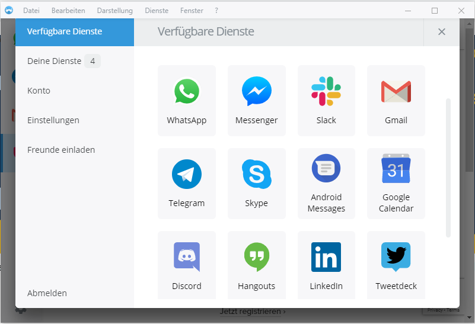
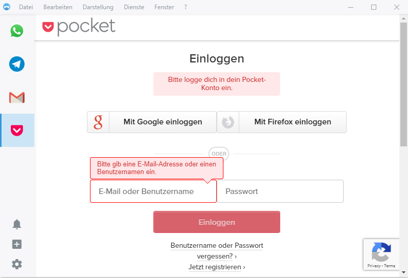

##The initial situation which is bad for us

So imagine this: You want to use your laptop for the most time of your day instead of your phone and you need to use WhatsApp because you want to stay in contact with your family, Telegram because your friends using this messenger, Slack or RocketChat for example because you need to communicate with your colleagues and of course your googlemail account to check all your emails in time. If you increment this to your own real world scenario you will end up with like 4-5 different messengers and news related applications. And now we have reached a point where we can say that this is not really handy or productive.  

##Who is this Franz guy and how he can solve my problem?

Well, Franz is a open source application licensed under the Apache-2.0 License. You can view the source code on GitHub: <a href="https://github.com/meetfranz/franz">Franz GitHub Page</a>. Briefly worded, Franz is a collector app for all your other messaging apps. So it's like you have one application and put all your other desktop apps in it. And that's the whole concept. This will release you from dabbling around in your tabs for minutes, only because you've heard a sound which is similar to "ring-ring" from one of your messengers.  

##Can I have a look?

Yes for sure. The following screenshots are only for you:  

    

  

I know. The configured language is german but please - don't blame me. I can't really show you any more screenshots of Franz, because the program is very uncomplicated in general. First of all you can create a Franz account (this step is optional and only needed if you want to import your configured settings to other devices). Just follow the installation wizard and voilà - after that your basic setup is ready. The only thing you have to do now is to add your services. This step is pretty easy. Just drag and drop your wished service inside Franz and use your login credentials. So that means, that you can use like 3 different googlemail accounts at once, if you want so.
  

